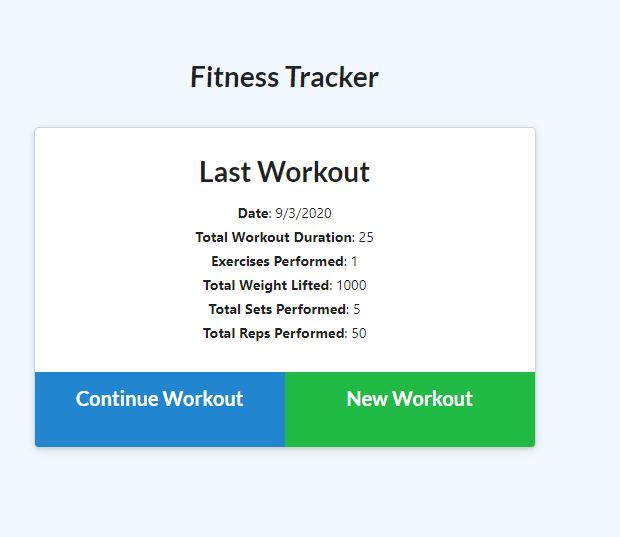
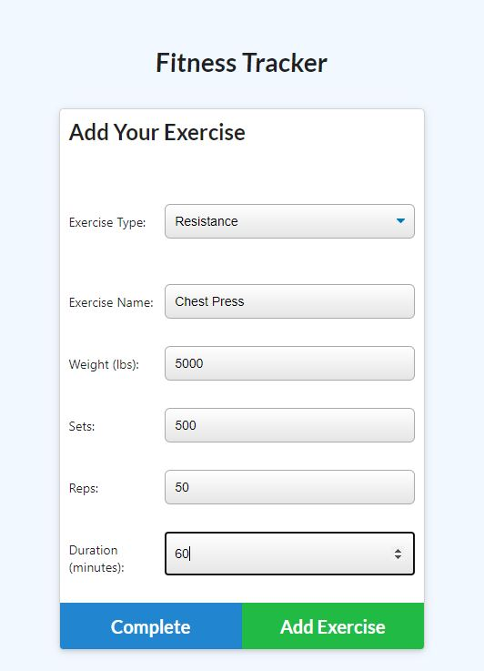
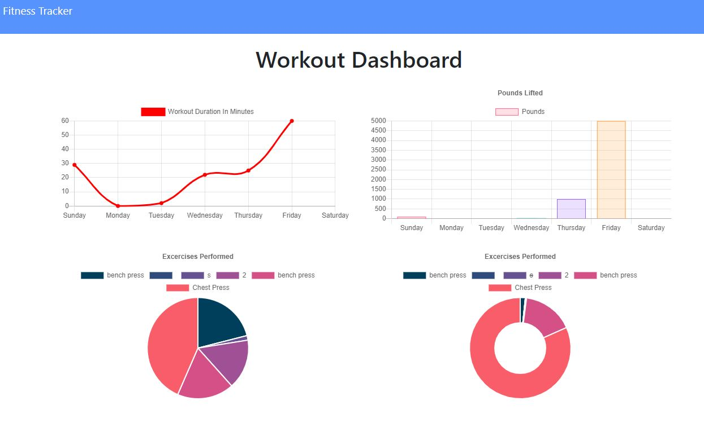

# Workout Tracker

## Description
Creating a workout tracker where front end code has been provided. A Mongo database with a Mongoose schema and handle routes ultilizing Express will be the highlight of this assignment. User will be able to create a workout, add and continue a workout and view all of their workouts.

## Dependencies
- mongoose
- express

## Heroku Deployed Link
https://ancient-earth-19560.herokuapp.com/

## Screenshots

## License
[MIT](https://choosealicense.com/licenses/mit/)
